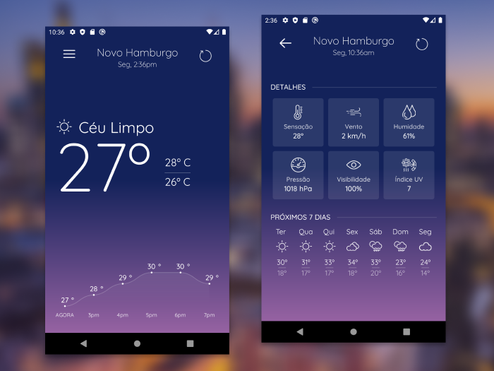
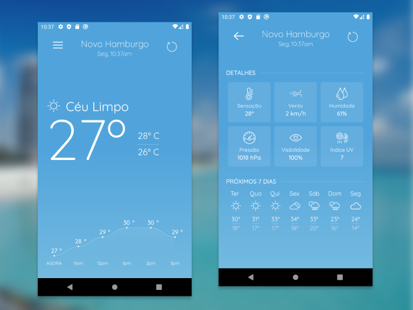

# Weather App
Este projeto foi um code challenge apresentado para mim pela [Platform Builders](https://platformbuilders.io/) e consiste de um app [React Native](https://facebook.github.io/react-native/) que exibe informações climáticas da localização atual do usuário em lindos degradês que mudam conforme o horário e a condição de clima atual. Todos os dados são providenciados pela [API Open Weather]('https://openweathermap.org/). 

    
    

## Layout

- [`App/Components`](App/Components): componentes de apresentação
- [`App/Containers`](App/Containers): componentes container
- [`App/Config`](App/Config): configuração do app
- [`App/Sagas`](App/Sagas): redux sagas
- [`App/Assets`](App/Assets): assets (imagens, videos etc)
- [`App/Services`](App/Services): serviços do app
- [`App/Theme`](App/Theme): estilos do app
- [`App/Navigators`](App/Navigators): navigators da react navigation 
- [`App/Stores`](App/Stores): redux actions, reducers e stores

## Dependências

- [React Native](https://facebook.github.io/react-native/)
- [React Navigation](https://reactnavigation.org/)
- [Redux](https://redux.js.org/)
- [Redux Sagas](https://redux-saga.js.org)
- [Redux Persist](https://github.com/rt2zz/redux-persist)
- [React-Native Chart Kit](https://github.com/indiespirit/react-native-chart-kit)
- [React-Native Get Location](https://github.com/douglasjunior/react-native-get-location)
- [React-Native Linear Gradient](https://github.com/react-native-linear-gradient/react-native-linear-gradient)
- [reduxsauce](https://github.com/infinitered/reduxsauce)
- [prettier](https://prettier.io/)
- [axios](https://github.com/axios/axios)

## Instalação

1. Clone este repositório.
2. Instale as dependências rodando `yarn` ou `npm install`.

### Android

  - `yarn start`
  - `yarn android`

### iOS

- `cd ios`
- Você precisa instalar as dependências pod.
  - `pod install`

- Agora você pode iniciar o bundler e instalar o app.
  - `yarn start`
  - `yarn ios`

## Testes

Testes são feitos com [jest](https://jestjs.io/) framework e [enzyme](https://airbnb.io/enzyme/) que torna fácil testar componentes React.

### Rodando testes
- `yarn test` ou `yarn test -u` se você fez alguma alteração.
